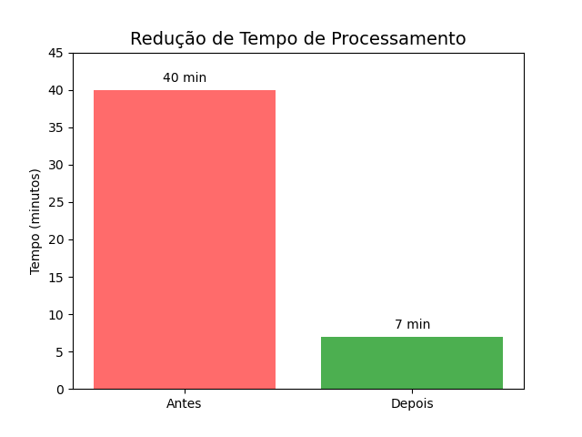

# 📊 Otimização de Consulta de Vendas com Parquet

## Impacto (Antes vs Depois)

**Redução de ~82% no tempo de processamento**
(40 minutos → 7 minutos)

---

## Sobre o projeto

Esse projeto surgiu de uma necessidade real: em um cenário de análise de dados de vendas, consultas ao banco estavam se tornando cada vez mais lentas devido ao alto volume de dados históricos.

Na prática, grande parte das análises utilizava apenas dados recentes, mas o banco ainda processava todo o histórico, impactando diretamente a performance.

A solução foi separar o que é histórico do que é corrente.

Impactos percebidos:
- Tempo elevado de carregamento
- Lentidão nos dashboards
- Experiência ruim para o usuário final

---

## Objetivo

Reduzir o tempo de processamento das consultas e melhorar a eficiência das análises.

---

## Solução

Processo em Python + SQL que:

- Extrai dados históricos (2024 e 2025)
- Armazena em formato Parquet
- Mantém no banco apenas dados recentes
- Permite consultas mais leves e rápidas

---

## Tecnologias

- Python  
- SQL  
- Oracle  
- cx_Oracle  
- Pandas  
- Parquet  

---

## Impacto no negócio

Antes da otimização:

- Tempo de carregamento da base: ~40 minutos  
- Alto volume de dados sendo processados em todas as consultas  
- Impacto direto na performance dos dashboards  

Depois da implementação:

- Tempo reduzido para ~7 minutos  
- Redução significativa na carga do banco  
- Consultas mais rápidas e estáveis  

---

## Observação

Este repositório não contém dados sensíveis nem qualquer acesso real à base da empresa.  
A estrutura foi adaptada apenas para demonstrar a solução aplicada em um contexto real.
